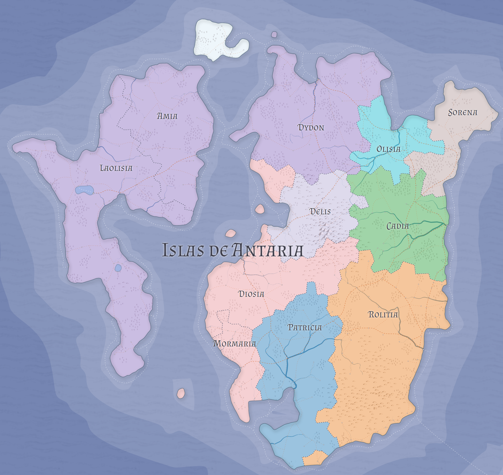

# El mundo

Ishtaras es un gran conjunto de macroislas en un vasto océano. Hacia el año 40.000 del Cosmos Renacido, existían 24 naciones repartidas en 3 vastas regiones.

### Islas de Antaria

Hacia el oeste del Archipiélago de la Tempestad, las Islas de Antaria contienen dos grandes islas, junto con algunos pequeños islotes distribuidos en el lecho marítimo de la región.

En Antaria Menor, existen dos grandes reinos: Amia y Laolisia. Antaria Mayor se reparte entre los reinos de Dydon, Delis, Diosia, Mormaria, Patricia, Rolitia, Cadia, Olisia y Sorena.

Hacia el norte, en Antaria Septentrional, existen las ciudades libres de Panvahai, Koste, Habo y Piekkuri.

En general, las Islas de Antaria son mayormente planicies y mesetas, con excepciones en algunas regiones de Delis, Diosia y Rolitia, donde se observan extensas colinas. Frondosos verdes bosques colorean las islas, llenándolas de fuentes de alimento y hierbas mágicas.

### Archipiélago de la Tempestad

Se trata de una gran isla y cuatro islas menores. En la Isla de la Tormenta, la mayor de las cinco, existen los reinos de Sperbo, Fonte, Ghefonterra, Fanhaisia y Gallano. Cania es una isla-reino. También existen dos ciudades libres: Veraro y Losge.

### Estaria

La más oriental de las islas de Ishtaras. Contiene los reinos de Carinhia, Flechimia, Ilheima, Parabia, Felvoria y Acasia. En la Estaria Meridional, reside en soledad la nación de Eicalhia.

### El Sur Olvidado

Una pequeña isla en el extremo sur de Ishtaras es hogar del mayor número de ciudades libres ubicadas en un mismo espacio geográfico. Aquí se establecen las ciudades de Nados, Torboe, Pioz, Allada, Quin, Ilcan, Artillanta y Socerta.

