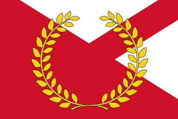

# Laolisia

Laolisia es una nación de las Islas de Antaria, con una extensión total de 388.353 km² y una población de 14,16 millones de habitantes. Su capital es la ciudad de Pyryloki, situada en el centro del reino, costeando el mayor de los lagos de su territorio.

